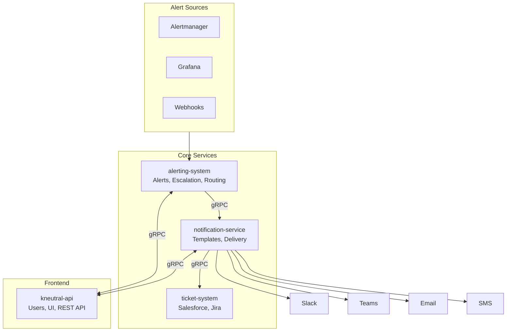

# OnCall System

A modern, gRPC-native alerting and ticketing platform designed to replace GoAlert with a simplified, extensible architecture.

## Architecture Overview

## Projects

| Project | Purpose | Status |
|---------|---------|--------|
| **alerting-system** | Alert ingestion, escalation policies, on-call scheduling | Planned |
| **notification-service** | Template management, multi-channel delivery | Planned |
| **ticket-system** | Extensible ticketing (Salesforce, Jira, ServiceNow) | Future |
| **kneutral-api** | User management, UI, REST API gateway | Existing |

## Key Features

- **gRPC-native**: All inter-service communication via gRPC
- **Dynamic Labels**: Full support for Prometheus labels/annotations (JSONB)
- **Template Management**: WYSIWYG preview, versioning, multi-channel support
- **CEL Routing**: Flexible routing rules without code changes
- **Extensible Ticketing**: Plugin architecture for external ticketing systems
- **No User Duplication**: Users managed centrally in kneutral-api

## Documentation

- [Architecture Plan](docs/ARCHITECTURE.md) - Detailed architecture with Mermaid diagrams

## Technology Stack

- **Language**: Go 1.22+
- **API**: gRPC + Protobuf, REST (Gin)
- **Database**: PostgreSQL with JSONB
- **Cache**: Redis
- **Infrastructure**: Kubernetes, Helm, ArgoCD

## Quick Links

- [kneutral-api](https://github.com/kneutral-org/kneutral-api) - User management and frontend
- [GoAlert](https://github.com/target/goalert) - Original inspiration

---

*This project was architected with AI consensus from Gemini 3 Pro Preview and GPT 5.2.*
