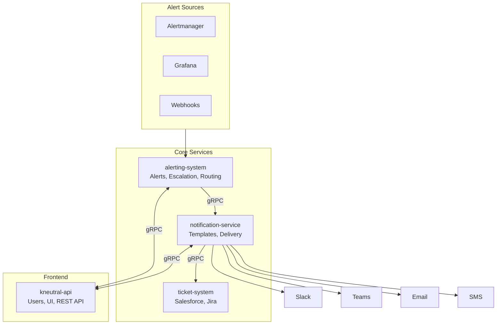

# OnCall System

A modern, gRPC-native alerting and on-call platform designed for **ISP and Datacenter operations**. Built to handle network infrastructure alerts, BGP/carrier issues, and NOC workflows with flexible routing and team management.

## Key Differentiators

- **ISP/Datacenter Native**: First-class support for sites, POPs, carriers, BGP alerts, and equipment types
- **Flexible Routing**: Simple mode (direct channel) or advanced mode (teams, schedules, escalations)
- **NOC Workflows**: Shift handoffs, maintenance windows, customer tier routing
- **Single-Tenant Deployments**: Each customer gets isolated infrastructure

## Architecture Overview

## Projects

| Project | Purpose | Status |
|---------|---------|--------|
| **alerting-system** | Alert ingestion, escalation policies, on-call scheduling | Planned |
| **notification-service** | Template management, multi-channel delivery | Planned |
| **ticket-system** | Extensible ticketing (Salesforce, Jira, ServiceNow) | Future |
| **kneutral-api** | User management, UI, REST API gateway | Existing |

## Key Features

### Alert Routing System
- **Dual-Mode Routing**: Simple (direct to Slack/Teams/Email) or Advanced (teams + schedules)
- **ISP/DC Conditions**: Route by site, POP, customer tier, equipment type, carrier
- **Time-Based Rules**: Business hours, after-hours, weekends with timezone support
- **CEL Expressions**: Advanced routing with Common Expression Language
- **Maintenance Windows**: Suppress/annotate alerts during planned maintenance

### Team & Schedule Management
- **On-Call Schedules**: Daily, weekly, biweekly, custom rotations
- **Multiple Layers**: Primary, secondary, weekend coverage
- **Shift Handoffs**: Automated reminders, acknowledgment, summary
- **Schedule Overrides**: PTO, sick leave, shift swaps

### ISP/Datacenter Features
- **Site/POP Management**: Datacenters, POPs, colocations, edge sites
- **Customer Tier Routing**: Enterprise/Premium/Standard with SLA response times
- **BGP/Carrier Handling**: Session down, route flap, hijack detection
- **Equipment Types**: Core router, edge switch, firewall with severity boost
- **NOC Workflows**: Tiered response (L0-L3), handoff procedures

### Core Platform
- **gRPC-native**: All inter-service communication via gRPC
- **Dynamic Labels**: Full support for Prometheus labels/annotations (JSONB)
- **Template Management**: WYSIWYG preview, versioning, multi-channel support
- **Extensible Ticketing**: Plugin architecture for external ticketing systems
- **No User Duplication**: Users managed centrally in kneutral-api

## Documentation

- [Architecture Plan](docs/ARCHITECTURE.md) - Detailed architecture with Mermaid diagrams
- [Alert Routing System](docs/ALERT_ROUTING_SYSTEM.md) - Comprehensive routing design for ISP/DC
- [Implementation Plan](docs/IMPLEMENTATION_PLAN.md) - Task breakdown with acceptance criteria

## Technology Stack

- **Language**: Go 1.22+
- **API**: gRPC + Protobuf, REST (Gin)
- **Database**: PostgreSQL with JSONB
- **Cache**: Redis
- **Infrastructure**: Kubernetes, Helm, ArgoCD

## Quick Links

- [kneutral-api](https://github.com/kneutral-org/kneutral-api) - User management and frontend
- [GoAlert](https://github.com/target/goalert) - Original inspiration

---

*This project was architected with AI consensus from Gemini 3 Pro Preview and GPT 5.2.*
