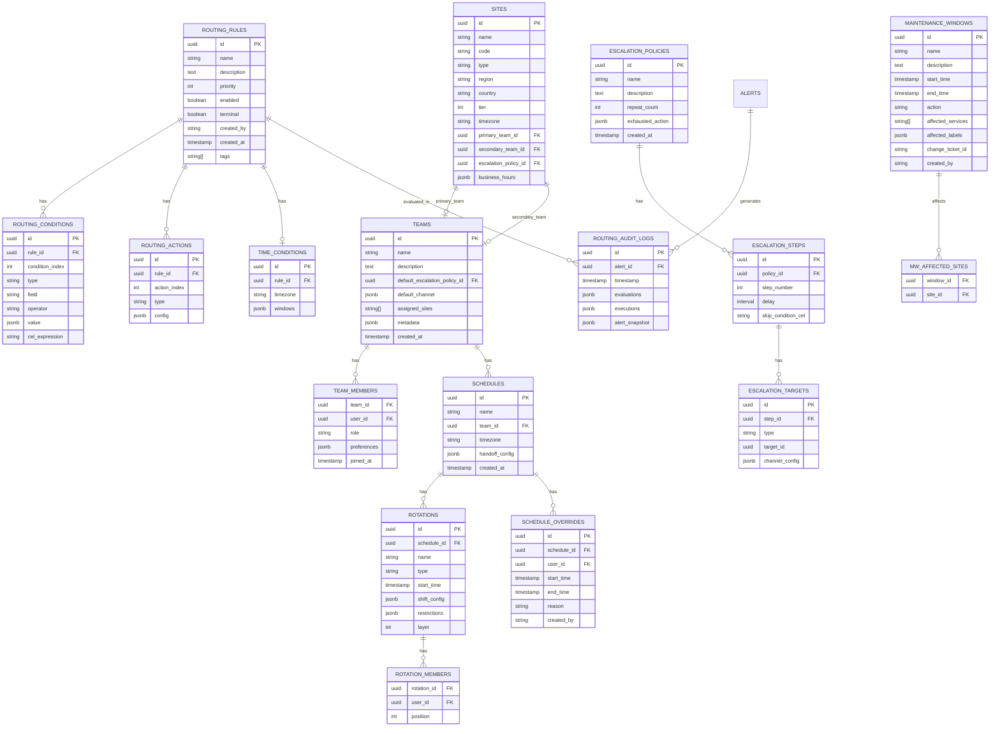

# Alert Routing System - Design Document

> A flexible, ISP/Datacenter-focused alert routing system supporting both simple channel notifications and advanced team-based scheduling with escalations.

## Table of Contents

1. [Overview](#overview)
2. [Data Model (Proto Definitions)](#data-model-proto-definitions)
3. [Routing Engine Logic](#routing-engine-logic)
4. [ISP/Datacenter Specific Features](#ispdatacenter-specific-features)
5. [Example Configurations](#example-configurations)
6. [API Design](#api-design)
7. [Architecture Diagrams](#architecture-diagrams)

---

## Overview

### Design Goals

1. **Dual-Mode Routing**: Support both simple (direct channel) and advanced (team-based with schedules) routing
2. **ISP/Datacenter Native**: First-class support for NOC workflows, site/POP routing, carrier alerts
3. **Flexible Conditions**: Match on labels, severity, source, customer tier, equipment type, time windows
4. **Extensible Actions**: Notify, suppress, aggregate, escalate, create tickets
5. **Auditable**: Full audit trail for routing decisions and rule changes

### Core Concepts

```
Alert --> Routing Engine --> [Match Rules] --> [Execute Actions] --> Notification Targets
                |
                +-- Maintenance Window Check
                +-- Time-based Condition Evaluation
                +-- Customer Tier Lookup
                +-- Site/POP Resolution
```

---

## Data Model (Proto Definitions)

### Core Routing Messages

```protobuf
syntax = "proto3";

package alerting.routing.v1;

import "google/protobuf/timestamp.proto";
import "google/protobuf/duration.proto";
import "google/protobuf/struct.proto";

option go_package = "github.com/kneutral-org/alerting-system/pkg/proto/routing/v1;routingv1";

// =============================================================================
// ROUTING RULES
// =============================================================================

// RoutingRule defines how alerts are routed to notification targets
message RoutingRule {
  string id = 1;
  string name = 2;
  string description = 3;

  // Ordering - lower priority values are evaluated first
  int32 priority = 4;

  // Rule is active and will be evaluated
  bool enabled = 5;

  // Conditions that must ALL match (AND logic)
  repeated RoutingCondition conditions = 6;

  // Actions to execute when conditions match
  repeated RoutingAction actions = 7;

  // If true, stop evaluating subsequent rules after this one matches
  bool terminal = 8;

  // Time-based conditions (optional)
  TimeCondition time_condition = 9;

  // Metadata for audit trail
  string created_by = 10;
  google.protobuf.Timestamp created_at = 11;
  string updated_by = 12;
  google.protobuf.Timestamp updated_at = 13;

  // Tags for organization
  repeated string tags = 14;
}

// RoutingCondition defines a single match condition
message RoutingCondition {
  // Type of condition
  ConditionType type = 1;

  // Field to match against
  string field = 2;

  // Operator for comparison
  ConditionOperator operator = 3;

  // Value(s) to compare
  oneof value {
    string string_value = 4;
    repeated string string_list = 5;
    int64 int_value = 6;
    bool bool_value = 7;
    string regex_pattern = 8;
  }

  // For CEL expressions (advanced)
  string cel_expression = 9;
}

enum ConditionType {
  CONDITION_TYPE_UNSPECIFIED = 0;

  // Label matching
  CONDITION_TYPE_LABEL = 1;

  // Annotation matching
  CONDITION_TYPE_ANNOTATION = 2;

  // Severity level
  CONDITION_TYPE_SEVERITY = 3;

  // Alert source (prometheus, grafana, etc.)
  CONDITION_TYPE_SOURCE = 4;

  // Service/integration key
  CONDITION_TYPE_SERVICE = 5;

  // ISP/DC specific
  CONDITION_TYPE_SITE = 6;
  CONDITION_TYPE_POP = 7;
  CONDITION_TYPE_CUSTOMER_TIER = 8;
  CONDITION_TYPE_EQUIPMENT_TYPE = 9;
  CONDITION_TYPE_CARRIER = 10;

  // Advanced CEL expression
  CONDITION_TYPE_CEL = 11;
}

enum ConditionOperator {
  CONDITION_OPERATOR_UNSPECIFIED = 0;
  CONDITION_OPERATOR_EQUALS = 1;
  CONDITION_OPERATOR_NOT_EQUALS = 2;
  CONDITION_OPERATOR_CONTAINS = 3;
  CONDITION_OPERATOR_NOT_CONTAINS = 4;
  CONDITION_OPERATOR_STARTS_WITH = 5;
  CONDITION_OPERATOR_ENDS_WITH = 6;
  CONDITION_OPERATOR_REGEX = 7;
  CONDITION_OPERATOR_IN = 8;
  CONDITION_OPERATOR_NOT_IN = 9;
  CONDITION_OPERATOR_EXISTS = 10;
  CONDITION_OPERATOR_NOT_EXISTS = 11;
  CONDITION_OPERATOR_GREATER_THAN = 12;
  CONDITION_OPERATOR_LESS_THAN = 13;
}

// RoutingAction defines what to do when a rule matches
message RoutingAction {
  ActionType type = 1;

  oneof action {
    NotifyTeamAction notify_team = 2;
    NotifyChannelAction notify_channel = 3;
    NotifyUserAction notify_user = 4;
    NotifyOnCallAction notify_oncall = 5;
    NotifyWebhookAction notify_webhook = 6;
    SuppressAction suppress = 7;
    AggregateAction aggregate = 8;
    EscalateAction escalate = 9;
    CreateTicketAction create_ticket = 10;
    SetLabelAction set_label = 11;
  }
}

enum ActionType {
  ACTION_TYPE_UNSPECIFIED = 0;
  ACTION_TYPE_NOTIFY_TEAM = 1;
  ACTION_TYPE_NOTIFY_CHANNEL = 2;
  ACTION_TYPE_NOTIFY_USER = 3;
  ACTION_TYPE_NOTIFY_ONCALL = 4;
  ACTION_TYPE_NOTIFY_WEBHOOK = 5;
  ACTION_TYPE_SUPPRESS = 6;
  ACTION_TYPE_AGGREGATE = 7;
  ACTION_TYPE_ESCALATE = 8;
  ACTION_TYPE_CREATE_TICKET = 9;
  ACTION_TYPE_SET_LABEL = 10;
}

// =============================================================================
// ACTION DETAILS
// =============================================================================

// NotifyTeamAction - sends to all team members or subset
message NotifyTeamAction {
  string team_id = 1;

  // Who in the team to notify
  TeamNotifyScope scope = 2;

  // Template to use
  string template_id = 3;
}

enum TeamNotifyScope {
  TEAM_NOTIFY_SCOPE_UNSPECIFIED = 0;
  TEAM_NOTIFY_SCOPE_ALL = 1;           // All team members
  TEAM_NOTIFY_SCOPE_ONCALL = 2;        // Only current on-call
  TEAM_NOTIFY_SCOPE_ONCALL_PRIMARY = 3; // Only primary on-call
  TEAM_NOTIFY_SCOPE_MANAGERS = 4;       // Only team managers
}

// NotifyChannelAction - direct channel notification (Simple Mode)
message NotifyChannelAction {
  NotificationTarget target = 1;
  string template_id = 2;
}

// NotifyUserAction - direct user notification
message NotifyUserAction {
  string user_id = 1;
  string template_id = 2;

  // Override user's preferred channel
  ChannelType channel_override = 3;
}

// NotifyOnCallAction - notify whoever is on-call for a schedule
message NotifyOnCallAction {
  string schedule_id = 1;
  string template_id = 2;

  // Notify primary, secondary, or both
  OnCallLevel level = 3;
}

enum OnCallLevel {
  ONCALL_LEVEL_UNSPECIFIED = 0;
  ONCALL_LEVEL_PRIMARY = 1;
  ONCALL_LEVEL_SECONDARY = 2;
  ONCALL_LEVEL_BOTH = 3;
}

// NotifyWebhookAction - send to external webhook
message NotifyWebhookAction {
  string webhook_url = 1;

  // HTTP method (POST default)
  string method = 2;

  // Custom headers
  map<string, string> headers = 3;

  // Template for payload transformation
  string template_id = 4;
}

// SuppressAction - suppress alert notifications
message SuppressAction {
  // Reason for suppression (audit)
  string reason = 1;

  // Duration to suppress
  google.protobuf.Duration duration = 2;

  // Create suppression record
  bool log_suppression = 3;
}

// AggregateAction - group similar alerts
message AggregateAction {
  // Field to group by
  repeated string group_by = 1;

  // Wait time before sending aggregated notification
  google.protobuf.Duration window = 2;

  // Max alerts to aggregate before forcing send
  int32 max_alerts = 3;

  // Template for aggregated notification
  string template_id = 4;

  // Where to send aggregated alert
  NotificationTarget target = 5;
}

// EscalateAction - trigger escalation policy
message EscalateAction {
  string escalation_policy_id = 1;

  // Override starting step
  int32 start_at_step = 2;

  // Skip wait times (immediate escalation)
  bool urgent = 3;
}

// CreateTicketAction - create external ticket
message CreateTicketAction {
  string provider_id = 1; // salesforce, jira, servicenow
  string project_key = 2;
  string ticket_type = 3;

  // Template for ticket description
  string template_id = 4;

  // Additional ticket fields
  map<string, string> fields = 5;
}

// SetLabelAction - add/modify alert labels
message SetLabelAction {
  map<string, string> labels = 1;
  bool overwrite_existing = 2;
}

// =============================================================================
// TIME CONDITIONS
// =============================================================================

// TimeCondition for time-based routing
message TimeCondition {
  // Timezone for evaluation
  string timezone = 1;

  // Time windows when rule is active
  repeated TimeWindow windows = 2;
}

message TimeWindow {
  // Days of week (0 = Sunday, 6 = Saturday)
  repeated int32 days_of_week = 1;

  // Start time (HH:MM)
  string start_time = 2;

  // End time (HH:MM)
  string end_time = 3;

  // Invert - rule active OUTSIDE this window
  bool invert = 4;
}

// =============================================================================
// NOTIFICATION TARGETS
// =============================================================================

// NotificationTarget represents where to send notifications
message NotificationTarget {
  ChannelType channel = 1;

  oneof target {
    SlackTarget slack = 2;
    TeamsTarget teams = 3;
    EmailTarget email = 4;
    SMSTarget sms = 5;
    WebhookTarget webhook = 6;
    PagerTarget pager = 7;
  }
}

enum ChannelType {
  CHANNEL_TYPE_UNSPECIFIED = 0;
  CHANNEL_TYPE_SLACK = 1;
  CHANNEL_TYPE_TEAMS = 2;
  CHANNEL_TYPE_EMAIL = 3;
  CHANNEL_TYPE_SMS = 4;
  CHANNEL_TYPE_VOICE = 5;
  CHANNEL_TYPE_WEBHOOK = 6;
  CHANNEL_TYPE_PAGER = 7;
  CHANNEL_TYPE_PUSH = 8;
}

message SlackTarget {
  // Channel ID (preferred) or channel name
  string channel_id = 1;
  string channel_name = 2;

  // Workspace ID for multi-workspace setups
  string workspace_id = 3;
}

message TeamsTarget {
  string channel_id = 1;
  string team_id = 2;

  // Webhook URL for incoming webhook integration
  string webhook_url = 3;
}

message EmailTarget {
  // Email addresses
  repeated string addresses = 1;

  // Distribution list name
  string distribution_list = 2;
}

message SMSTarget {
  repeated string phone_numbers = 1;
}

message WebhookTarget {
  string url = 1;
  string method = 2;
  map<string, string> headers = 3;
}

message PagerTarget {
  string service_key = 1;
}

// =============================================================================
// TEAM MANAGEMENT
// =============================================================================

// Team represents a group of users with shared on-call responsibilities
message Team {
  string id = 1;
  string name = 2;
  string description = 3;

  // Team members
  repeated TeamMember members = 4;

  // On-call schedules for this team
  repeated string schedule_ids = 5;

  // Default escalation policy
  string default_escalation_policy_id = 6;

  // Default notification channel for team alerts
  NotificationTarget default_channel = 7;

  // Team managers (can edit team config)
  repeated string manager_user_ids = 8;

  // ISP/DC specific
  repeated string assigned_sites = 9;
  repeated string assigned_pops = 10;

  // Metadata
  map<string, string> metadata = 11;
  google.protobuf.Timestamp created_at = 12;
}

message TeamMember {
  string user_id = 1;
  TeamRole role = 2;

  // Member-specific notification preferences
  NotificationPreferences preferences = 3;

  google.protobuf.Timestamp joined_at = 4;
}

enum TeamRole {
  TEAM_ROLE_UNSPECIFIED = 0;
  TEAM_ROLE_MEMBER = 1;
  TEAM_ROLE_LEAD = 2;
  TEAM_ROLE_MANAGER = 3;
}

message NotificationPreferences {
  // Preferred channels in order
  repeated ChannelType preferred_channels = 1;

  // Quiet hours (do not disturb)
  repeated TimeWindow quiet_hours = 2;

  // Escalation delay override
  google.protobuf.Duration escalation_delay = 3;
}

// =============================================================================
// SCHEDULES & SHIFTS
// =============================================================================

// Schedule defines on-call rotation for a team
message Schedule {
  string id = 1;
  string name = 2;
  string description = 3;

  // Owning team
  string team_id = 4;

  // Timezone for schedule interpretation
  string timezone = 5;

  // Rotation layers (can have multiple overlapping)
  repeated Rotation rotations = 6;

  // Manual overrides
  repeated ScheduleOverride overrides = 7;

  // Handoff configuration
  HandoffConfig handoff = 8;

  // Metadata
  google.protobuf.Timestamp created_at = 9;
  google.protobuf.Timestamp updated_at = 10;
}

// Rotation defines a repeating on-call pattern
message Rotation {
  string id = 1;
  string name = 2;

  // Rotation type
  RotationType type = 3;

  // Members in rotation order
  repeated RotationMember members = 4;

  // When rotation starts
  google.protobuf.Timestamp start_time = 5;

  // Shift configuration
  ShiftConfig shift_config = 6;

  // Restrictions (only active during certain times)
  repeated TimeWindow restrictions = 7;

  // Layer priority (higher = takes precedence)
  int32 layer = 8;
}

enum RotationType {
  ROTATION_TYPE_UNSPECIFIED = 0;
  ROTATION_TYPE_DAILY = 1;
  ROTATION_TYPE_WEEKLY = 2;
  ROTATION_TYPE_BIWEEKLY = 3;
  ROTATION_TYPE_CUSTOM = 4;
}

message RotationMember {
  string user_id = 1;
  int32 position = 2; // Order in rotation
}

message ShiftConfig {
  // Shift length
  google.protobuf.Duration shift_length = 1;

  // Handoff time (e.g., "09:00")
  string handoff_time = 2;

  // Days for handoff (empty = every day matching shift_length)
  repeated int32 handoff_days = 3;
}

// ScheduleOverride for manual schedule changes
message ScheduleOverride {
  string id = 1;

  // User taking over
  string user_id = 2;

  // Override period
  google.protobuf.Timestamp start_time = 3;
  google.protobuf.Timestamp end_time = 4;

  // Reason for override
  string reason = 5;

  // Who created the override
  string created_by = 6;
  google.protobuf.Timestamp created_at = 7;
}

// Shift represents an actual on-call shift instance
message Shift {
  string id = 1;
  string schedule_id = 2;
  string rotation_id = 3;

  // User on-call during this shift
  string user_id = 4;

  // Shift timing
  google.protobuf.Timestamp start_time = 5;
  google.protobuf.Timestamp end_time = 6;

  // Type of shift
  ShiftType type = 7;

  // For secondary/backup
  int32 oncall_level = 8; // 1 = primary, 2 = secondary, etc.
}

enum ShiftType {
  SHIFT_TYPE_UNSPECIFIED = 0;
  SHIFT_TYPE_REGULAR = 1;
  SHIFT_TYPE_OVERRIDE = 2;
  SHIFT_TYPE_SWAP = 3;
}

// HandoffConfig for shift transitions
message HandoffConfig {
  // Minutes before handoff to notify outgoing
  int32 outgoing_reminder_minutes = 1;

  // Minutes before handoff to notify incoming
  int32 incoming_reminder_minutes = 2;

  // Template for handoff notifications
  string template_id = 3;

  // Channel for handoff notifications
  NotificationTarget handoff_channel = 4;

  // Require acknowledgment from incoming
  bool require_ack = 5;

  // Auto-escalate if no ack within N minutes
  int32 escalate_if_no_ack_minutes = 6;
}

// =============================================================================
// ISP/DATACENTER SPECIFIC
// =============================================================================

// Site represents a physical location (datacenter, POP)
message Site {
  string id = 1;
  string name = 2;
  string code = 3; // e.g., "IAD1", "SJC2"

  SiteType type = 4;

  // Geographic info
  string region = 5;
  string country = 6;
  string city = 7;

  // Assigned team
  string primary_team_id = 8;
  string secondary_team_id = 9;

  // Escalation policy for this site
  string escalation_policy_id = 10;

  // Tier for prioritization
  int32 tier = 11; // 1 = critical, 2 = important, 3 = standard

  // Time zone
  string timezone = 12;

  // Business hours
  repeated TimeWindow business_hours = 13;
}

enum SiteType {
  SITE_TYPE_UNSPECIFIED = 0;
  SITE_TYPE_DATACENTER = 1;
  SITE_TYPE_POP = 2;
  SITE_TYPE_COLOCATION = 3;
  SITE_TYPE_EDGE = 4;
  SITE_TYPE_OFFICE = 5;
}

// CustomerTier for prioritization
message CustomerTier {
  string id = 1;
  string name = 2; // e.g., "Enterprise", "Premium", "Standard"

  // Tier level (1 = highest priority)
  int32 level = 1;

  // SLA response times
  google.protobuf.Duration critical_response = 3;
  google.protobuf.Duration high_response = 4;
  google.protobuf.Duration medium_response = 5;

  // Escalation multiplier (1.0 = normal, 0.5 = 2x faster)
  float escalation_multiplier = 6;

  // Dedicated team
  string dedicated_team_id = 7;
}

// EquipmentType for equipment-based routing
message EquipmentType {
  string id = 1;
  string name = 2; // e.g., "Core Router", "Edge Switch", "Firewall"
  string category = 3; // e.g., "Network", "Compute", "Storage"

  // Severity boost for this equipment type
  int32 severity_boost = 4;

  // Required team capabilities
  repeated string required_capabilities = 5;

  // Default escalation policy
  string escalation_policy_id = 6;
}

// CarrierConfig for BGP/carrier-specific routing
message CarrierConfig {
  string id = 1;
  string name = 2; // e.g., "Level3", "Cogent", "HE"
  string asn = 3;

  // NOC contact info
  string noc_email = 4;
  string noc_phone = 5;
  string noc_portal_url = 6;

  // Internal team responsible
  string team_id = 7;

  // Auto-create ticket on BGP alerts
  bool auto_ticket = 8;
  string ticket_provider_id = 9;
}

// MaintenanceWindow for planned maintenance
message MaintenanceWindow {
  string id = 1;
  string name = 2;
  string description = 3;

  // Maintenance period
  google.protobuf.Timestamp start_time = 4;
  google.protobuf.Timestamp end_time = 5;

  // What's affected
  repeated string affected_sites = 6;
  repeated string affected_services = 7;
  repeated string affected_labels = 8; // label matchers

  // Action during maintenance
  MaintenanceAction action = 9;

  // Creator info
  string created_by = 10;
  google.protobuf.Timestamp created_at = 11;

  // Change ticket reference
  string change_ticket_id = 12;
}

enum MaintenanceAction {
  MAINTENANCE_ACTION_UNSPECIFIED = 0;
  MAINTENANCE_ACTION_SUPPRESS = 1;      // Suppress matching alerts
  MAINTENANCE_ACTION_ANNOTATE = 2;      // Add maintenance label, still notify
  MAINTENANCE_ACTION_REDUCE_SEVERITY = 3; // Downgrade severity
}

// =============================================================================
// ESCALATION POLICIES
// =============================================================================

// EscalationPolicy defines how alerts escalate over time
message EscalationPolicy {
  string id = 1;
  string name = 2;
  string description = 3;

  // Escalation steps in order
  repeated EscalationStep steps = 4;

  // Number of times to repeat the entire policy
  int32 repeat_count = 5;

  // What to do if escalation exhausted
  EscalationExhaustedAction exhausted_action = 6;

  // Metadata
  google.protobuf.Timestamp created_at = 7;
}

message EscalationStep {
  int32 step_number = 1;

  // Delay before this step executes (0 for immediate first step)
  google.protobuf.Duration delay = 2;

  // Targets to notify at this step
  repeated EscalationTarget targets = 3;

  // Condition to skip this step
  string skip_condition_cel = 4;
}

message EscalationTarget {
  EscalationTargetType type = 1;

  oneof target {
    string user_id = 2;
    string schedule_id = 3;
    string team_id = 4;
    NotificationTarget channel = 5;
  }
}

enum EscalationTargetType {
  ESCALATION_TARGET_TYPE_UNSPECIFIED = 0;
  ESCALATION_TARGET_TYPE_USER = 1;
  ESCALATION_TARGET_TYPE_SCHEDULE = 2;
  ESCALATION_TARGET_TYPE_TEAM = 3;
  ESCALATION_TARGET_TYPE_CHANNEL = 4;
}

message EscalationExhaustedAction {
  // What to do
  ExhaustedActionType type = 1;

  // Target if type is NOTIFY
  NotificationTarget fallback_target = 2;

  // Create incident if type is CREATE_INCIDENT
  string incident_severity = 3;
}

enum ExhaustedActionType {
  EXHAUSTED_ACTION_TYPE_UNSPECIFIED = 0;
  EXHAUSTED_ACTION_TYPE_STOP = 1;
  EXHAUSTED_ACTION_TYPE_REPEAT = 2;
  EXHAUSTED_ACTION_TYPE_NOTIFY_FALLBACK = 3;
  EXHAUSTED_ACTION_TYPE_CREATE_INCIDENT = 4;
}

// =============================================================================
// ROUTING AUDIT
// =============================================================================

// RoutingAuditLog records routing decisions for debugging/compliance
message RoutingAuditLog {
  string id = 1;
  string alert_id = 2;

  // Timestamp of routing decision
  google.protobuf.Timestamp timestamp = 3;

  // Rules evaluated
  repeated RuleEvaluation evaluations = 4;

  // Final actions taken
  repeated ActionExecution executions = 5;

  // Input alert snapshot
  google.protobuf.Struct alert_snapshot = 6;
}

message RuleEvaluation {
  string rule_id = 1;
  string rule_name = 2;
  int32 priority = 3;

  // Did all conditions match?
  bool matched = 4;

  // Individual condition results
  repeated ConditionResult condition_results = 5;

  // Was this rule terminal (stopped evaluation)?
  bool terminal = 6;
}

message ConditionResult {
  int32 condition_index = 1;
  ConditionType type = 2;
  string field = 3;
  string expected = 4;
  string actual = 5;
  bool matched = 6;
}

message ActionExecution {
  string rule_id = 1;
  ActionType action_type = 2;

  // Action details
  google.protobuf.Struct action_details = 3;

  // Execution result
  bool success = 4;
  string error_message = 5;

  // For notify actions
  repeated string notification_ids = 6;
}
```

---

## Routing Engine Logic

### Rule Evaluation Flowchart


### Condition Matching Algorithm

```go
// ConditionMatcher evaluates routing conditions against an alert
type ConditionMatcher struct {
    siteResolver     SiteResolver
    customerResolver CustomerResolver
    celEvaluator     *cel.Env
}

// Match evaluates all conditions (AND logic)
func (m *ConditionMatcher) Match(ctx context.Context, alert *Alert, conditions []*RoutingCondition) (bool, []ConditionResult) {
    results := make([]ConditionResult, len(conditions))

    for i, cond := range conditions {
        result := m.evaluateCondition(ctx, alert, cond)
        results[i] = result

        // Short-circuit on first failure (AND logic)
        if !result.Matched {
            return false, results
        }
    }

    return true, results
}

func (m *ConditionMatcher) evaluateCondition(ctx context.Context, alert *Alert, cond *RoutingCondition) ConditionResult {
    var actual string

    switch cond.Type {
    case ConditionTypeLABEL:
        actual = alert.Labels[cond.Field]

    case ConditionTypeANNOTATION:
        actual = alert.Annotations[cond.Field]

    case ConditionTypeSEVERITY:
        actual = alert.Labels["severity"]

    case ConditionTypeSOURCE:
        actual = alert.Source.String()

    case ConditionTypeSITE:
        // Resolve site from alert labels
        site := m.siteResolver.Resolve(alert)
        actual = site.Code

    case ConditionTypePOP:
        site := m.siteResolver.Resolve(alert)
        if site.Type == SiteTypePOP {
            actual = site.Code
        }

    case ConditionTypeCUSTOMER_TIER:
        tier := m.customerResolver.GetTier(alert)
        actual = tier.Name

    case ConditionTypeEQUIPMENT_TYPE:
        actual = alert.Labels["equipment_type"]

    case ConditionTypeCARRIER:
        actual = alert.Labels["carrier"]

    case ConditionTypeCEL:
        return m.evaluateCEL(alert, cond.CelExpression)
    }

    matched := m.compareValues(actual, cond.Operator, cond.Value)

    return ConditionResult{
        Type:     cond.Type,
        Field:    cond.Field,
        Expected: fmt.Sprint(cond.Value),
        Actual:   actual,
        Matched:  matched,
    }
}

func (m *ConditionMatcher) compareValues(actual string, op ConditionOperator, expected interface{}) bool {
    switch op {
    case ConditionOperatorEQUALS:
        return actual == expected.(string)

    case ConditionOperatorNOT_EQUALS:
        return actual != expected.(string)

    case ConditionOperatorCONTAINS:
        return strings.Contains(actual, expected.(string))

    case ConditionOperatorSTARTS_WITH:
        return strings.HasPrefix(actual, expected.(string))

    case ConditionOperatorREGEX:
        re := regexp.MustCompile(expected.(string))
        return re.MatchString(actual)

    case ConditionOperatorIN:
        for _, v := range expected.([]string) {
            if actual == v {
                return true
            }
        }
        return false

    case ConditionOperatorEXISTS:
        return actual != ""

    case ConditionOperatorNOT_EXISTS:
        return actual == ""
    }

    return false
}
```

### Action Executor


### Fallback Behavior

```go
// DefaultActions when no rules match
type DefaultActions struct {
    // Minimum severity to create any notification
    MinNotifySeverity Severity

    // Default channel for unrouted alerts
    DefaultChannel *NotificationTarget

    // Create catch-all ticket
    CreateUnroutedTicket bool

    // Default template
    DefaultTemplateID string
}

func (r *RoutingEngine) handleNoMatchingRules(ctx context.Context, alert *Alert) {
    defaults := r.config.DefaultActions

    // Log unrouted alert
    r.metrics.UnroutedAlertsTotal.Inc()
    r.auditLog.LogUnrouted(alert)

    // Check minimum severity
    if alert.Severity < defaults.MinNotifySeverity {
        return
    }

    // Send to default channel
    if defaults.DefaultChannel != nil {
        r.notifier.SendToChannel(ctx, defaults.DefaultChannel, defaults.DefaultTemplateID, alert)
    }

    // Create catch-all ticket
    if defaults.CreateUnroutedTicket {
        r.ticketService.CreateUnroutedTicket(ctx, alert)
    }
}
```

---

## ISP/Datacenter Specific Features

### NOC Shift Handoff Workflow


### Site/POP Routing Logic

```go
// SiteRouter handles site-specific routing logic
type SiteRouter struct {
    siteStore     SiteStore
    teamStore     TeamStore
    weatherStore  WeatherAlertStore // For disaster awareness
}

func (r *SiteRouter) EnrichAlert(ctx context.Context, alert *Alert) *EnrichedAlert {
    enriched := &EnrichedAlert{Alert: alert}

    // Resolve site from labels
    siteCode := alert.Labels["site"]
    if siteCode == "" {
        siteCode = alert.Labels["datacenter"]
    }
    if siteCode == "" {
        siteCode = alert.Labels["pop"]
    }

    if siteCode == "" {
        return enriched
    }

    site, err := r.siteStore.GetByCode(ctx, siteCode)
    if err != nil {
        return enriched
    }

    enriched.Site = site
    enriched.PrimaryTeam = r.teamStore.Get(ctx, site.PrimaryTeamID)
    enriched.SecondaryTeam = r.teamStore.Get(ctx, site.SecondaryTeamID)

    // Check for weather/disaster alerts affecting this site
    weatherAlerts := r.weatherStore.GetAlertsForRegion(ctx, site.Region)
    if len(weatherAlerts) > 0 {
        enriched.DisasterContext = weatherAlerts
        // Boost severity for disaster-affected sites
        alert.Labels["disaster_affected"] = "true"
    }

    return enriched
}
```

### Customer Tier Escalation

```yaml
# Example: Customer tier multipliers
customer_tiers:
  enterprise:
    level: 1
    escalation_multiplier: 0.5  # 2x faster escalation
    response_times:
      critical: 5m
      high: 15m
      medium: 1h
    dedicated_team: enterprise-support

  premium:
    level: 2
    escalation_multiplier: 0.75
    response_times:
      critical: 15m
      high: 30m
      medium: 2h

  standard:
    level: 3
    escalation_multiplier: 1.0
    response_times:
      critical: 30m
      high: 1h
      medium: 4h
```

### BGP/Carrier Alert Handling


### Maintenance Window Integration

```go
// MaintenanceChecker handles maintenance window logic
type MaintenanceChecker struct {
    store MaintenanceWindowStore
}

func (c *MaintenanceChecker) Check(ctx context.Context, alert *Alert) *MaintenanceResult {
    windows := c.store.GetActiveWindows(ctx)

    for _, window := range windows {
        if c.alertMatchesWindow(alert, window) {
            return &MaintenanceResult{
                InMaintenance: true,
                Window:        window,
                Action:        window.Action,
            }
        }
    }

    return &MaintenanceResult{InMaintenance: false}
}

func (c *MaintenanceChecker) alertMatchesWindow(alert *Alert, window *MaintenanceWindow) bool {
    // Check site match
    for _, site := range window.AffectedSites {
        if alert.Labels["site"] == site {
            return true
        }
    }

    // Check service match
    for _, service := range window.AffectedServices {
        if alert.Labels["service"] == service {
            return true
        }
    }

    // Check label matchers (Prometheus-style)
    for _, matcher := range window.AffectedLabels {
        if c.matchesLabelSelector(alert.Labels, matcher) {
            return true
        }
    }

    return false
}
```

---

## Example Configurations

### Simple Mode: All Alerts to Channel

```yaml
# Simple routing - no teams/schedules needed
routing_rules:
  - id: "default-all-to-slack"
    name: "All alerts to #alerts channel"
    priority: 100
    enabled: true
    conditions: []  # No conditions = match all
    actions:
      - type: NOTIFY_CHANNEL
        notify_channel:
          target:
            channel: SLACK
            slack:
              channel_id: "C12345678"
          template_id: "default-alert"
    terminal: true
```

### Medium: Severity-Based Routing

```yaml
routing_rules:
  # Critical alerts go to on-call
  - id: "critical-to-oncall"
    name: "Critical alerts to on-call"
    priority: 10
    enabled: true
    conditions:
      - type: SEVERITY
        operator: EQUALS
        string_value: "critical"
    actions:
      - type: NOTIFY_ONCALL
        notify_oncall:
          schedule_id: "primary-oncall"
          template_id: "critical-alert"
          level: PRIMARY
      - type: ESCALATE
        escalate:
          escalation_policy_id: "critical-policy"
    terminal: false

  # High severity to team channel
  - id: "high-to-channel"
    name: "High severity to team channel"
    priority: 20
    enabled: true
    conditions:
      - type: SEVERITY
        operator: EQUALS
        string_value: "high"
    actions:
      - type: NOTIFY_CHANNEL
        notify_channel:
          target:
            channel: SLACK
            slack:
              channel_id: "C-HIGH-ALERTS"
          template_id: "high-alert"
    terminal: false

  # Warning to low-priority channel
  - id: "warning-to-lowpri"
    name: "Warnings to low-pri channel"
    priority: 30
    enabled: true
    conditions:
      - type: SEVERITY
        operator: IN
        string_list: ["warning", "info"]
    actions:
      - type: NOTIFY_CHANNEL
        notify_channel:
          target:
            channel: SLACK
            slack:
              channel_id: "C-LOWPRI"
          template_id: "warning-alert"
    terminal: true
```

### Complex: ISP/Datacenter Full Example

```yaml
routing_rules:
  # ==========================================================
  # HIGHEST PRIORITY: BGP/Carrier Issues
  # ==========================================================

  - id: "bgp-hijack"
    name: "BGP Hijack - Immediate Escalation"
    priority: 1
    enabled: true
    conditions:
      - type: LABEL
        field: "alertname"
        operator: EQUALS
        string_value: "BGPHijackDetected"
    actions:
      - type: NOTIFY_USER
        notify_user:
          user_id: "noc-lead"
          template_id: "bgp-hijack-critical"
          channel_override: VOICE
      - type: NOTIFY_TEAM
        notify_team:
          team_id: "security-team"
          scope: ALL
          template_id: "bgp-hijack-security"
      - type: CREATE_TICKET
        create_ticket:
          provider_id: "servicenow"
          ticket_type: "P1_Incident"
          template_id: "bgp-hijack-ticket"
    terminal: true

  - id: "carrier-down"
    name: "Carrier/Upstream Down"
    priority: 5
    enabled: true
    conditions:
      - type: LABEL
        field: "alertname"
        operator: IN
        string_list: ["BGPSessionDown", "TransitProviderDown"]
      - type: LABEL
        field: "carrier"
        operator: EXISTS
    actions:
      - type: NOTIFY_ONCALL
        notify_oncall:
          schedule_id: "noc-schedule"
          level: PRIMARY
          template_id: "carrier-down"
      - type: CREATE_TICKET
        create_ticket:
          provider_id: "carrier-portal"
          template_id: "carrier-outage-ticket"
    terminal: false

  # ==========================================================
  # CORE EQUIPMENT ALERTS
  # ==========================================================

  - id: "core-router-critical"
    name: "Core Router Critical - NOC Lead + Escalate"
    priority: 10
    enabled: true
    conditions:
      - type: EQUIPMENT_TYPE
        operator: EQUALS
        string_value: "core_router"
      - type: SEVERITY
        operator: IN
        string_list: ["critical", "emergency"]
    actions:
      - type: NOTIFY_USER
        notify_user:
          user_id: "noc-lead"
          template_id: "core-router-critical"
      - type: NOTIFY_ONCALL
        notify_oncall:
          schedule_id: "network-oncall"
          level: BOTH
          template_id: "core-router-critical"
      - type: ESCALATE
        escalate:
          escalation_policy_id: "core-equipment-policy"
          urgent: true
    terminal: false

  # ==========================================================
  # CUSTOMER TIER ROUTING
  # ==========================================================

  - id: "enterprise-customer-critical"
    name: "Enterprise Customer - Fast Track"
    priority: 15
    enabled: true
    conditions:
      - type: CUSTOMER_TIER
        operator: EQUALS
        string_value: "enterprise"
      - type: SEVERITY
        operator: IN
        string_list: ["critical", "high"]
    actions:
      - type: NOTIFY_TEAM
        notify_team:
          team_id: "enterprise-support"
          scope: ONCALL
          template_id: "enterprise-alert"
      - type: ESCALATE
        escalate:
          escalation_policy_id: "enterprise-escalation"
      - type: CREATE_TICKET
        create_ticket:
          provider_id: "salesforce"
          ticket_type: "Case"
          fields:
            Priority: "P1"
            CustomerTier: "Enterprise"
    terminal: false

  # ==========================================================
  # AFTER HOURS ROUTING
  # ==========================================================

  - id: "afterhours-critical-only"
    name: "After Hours - Critical Only"
    priority: 20
    enabled: true
    time_condition:
      timezone: "America/New_York"
      windows:
        - days_of_week: [0, 1, 2, 3, 4, 5, 6]
          start_time: "18:00"
          end_time: "08:00"
        - days_of_week: [0, 6]  # Weekend
          start_time: "00:00"
          end_time: "23:59"
    conditions:
      - type: SEVERITY
        operator: IN
        string_list: ["warning", "info"]
    actions:
      - type: SUPPRESS
        suppress:
          reason: "After-hours non-critical alert"
          log_suppression: true
    terminal: true

  # ==========================================================
  # SITE-SPECIFIC ROUTING
  # ==========================================================

  - id: "tier1-site-alerts"
    name: "Tier 1 Sites - Enhanced Response"
    priority: 25
    enabled: true
    conditions:
      - type: SITE
        operator: IN
        string_list: ["IAD1", "SJC1", "AMS1"]  # Tier 1 sites
    actions:
      - type: SET_LABEL
        set_label:
          labels:
            site_tier: "1"
            enhanced_response: "true"
      - type: NOTIFY_ONCALL
        notify_oncall:
          schedule_id: "tier1-site-oncall"
          level: PRIMARY
          template_id: "tier1-site-alert"
    terminal: false

  # ==========================================================
  # ALERT AGGREGATION
  # ==========================================================

  - id: "aggregate-warnings"
    name: "Aggregate Warning Alerts"
    priority: 80
    enabled: true
    conditions:
      - type: SEVERITY
        operator: EQUALS
        string_value: "warning"
    actions:
      - type: AGGREGATE
        aggregate:
          group_by: ["alertname", "site"]
          window: "5m"
          max_alerts: 10
          template_id: "aggregated-warnings"
          target:
            channel: SLACK
            slack:
              channel_id: "C-WARNINGS"
    terminal: true

  # ==========================================================
  # DEFAULT CATCH-ALL
  # ==========================================================

  - id: "default-routing"
    name: "Default - All Unmatched Alerts"
    priority: 100
    enabled: true
    conditions: []
    actions:
      - type: NOTIFY_CHANNEL
        notify_channel:
          target:
            channel: SLACK
            slack:
              channel_id: "C-ALL-ALERTS"
          template_id: "default-alert"
    terminal: true
```

### Escalation Policy Example

```yaml
escalation_policies:
  - id: "core-equipment-policy"
    name: "Core Equipment Escalation"
    description: "Escalation for core network equipment"
    steps:
      - step_number: 1
        delay: "0s"  # Immediate
        targets:
          - type: SCHEDULE
            schedule_id: "network-oncall"

      - step_number: 2
        delay: "5m"
        targets:
          - type: USER
            user_id: "network-lead"
          - type: CHANNEL
            channel:
              channel: SLACK
              slack:
                channel_id: "C-NETWORK-ESCALATION"

      - step_number: 3
        delay: "15m"
        targets:
          - type: TEAM
            team_id: "network-managers"
          - type: USER
            user_id: "vp-infrastructure"

    repeat_count: 2
    exhausted_action:
      type: CREATE_INCIDENT
      incident_severity: "P1"
```

### Schedule Example

```yaml
schedules:
  - id: "noc-schedule"
    name: "NOC 24/7 Schedule"
    team_id: "noc-team"
    timezone: "UTC"

    rotations:
      # Day shift rotation
      - id: "day-shift"
        name: "Day Shift (08:00-20:00 UTC)"
        type: WEEKLY
        members:
          - user_id: "alice"
            position: 1
          - user_id: "bob"
            position: 2
          - user_id: "charlie"
            position: 3
        shift_config:
          shift_length: "168h"  # 1 week
          handoff_time: "08:00"
          handoff_days: [1]  # Monday
        restrictions:
          - days_of_week: [1, 2, 3, 4, 5]
            start_time: "08:00"
            end_time: "20:00"
        layer: 1

      # Night shift rotation
      - id: "night-shift"
        name: "Night Shift (20:00-08:00 UTC)"
        type: WEEKLY
        members:
          - user_id: "david"
            position: 1
          - user_id: "eve"
            position: 2
        shift_config:
          shift_length: "168h"
          handoff_time: "20:00"
          handoff_days: [1]
        restrictions:
          - days_of_week: [1, 2, 3, 4, 5]
            start_time: "20:00"
            end_time: "08:00"
        layer: 1

      # Weekend rotation
      - id: "weekend"
        name: "Weekend Coverage"
        type: BIWEEKLY
        members:
          - user_id: "frank"
            position: 1
          - user_id: "grace"
            position: 2
        shift_config:
          shift_length: "336h"  # 2 weeks
          handoff_time: "08:00"
          handoff_days: [6]  # Saturday
        restrictions:
          - days_of_week: [0, 6]
            start_time: "00:00"
            end_time: "23:59"
        layer: 2

    handoff:
      outgoing_reminder_minutes: 30
      incoming_reminder_minutes: 15
      template_id: "handoff-notification"
      handoff_channel:
        channel: SLACK
        slack:
          channel_id: "C-NOC-HANDOFF"
      require_ack: true
      escalate_if_no_ack_minutes: 10
```

---

## API Design

### Routing Rules API

```protobuf
// RoutingService provides CRUD operations for routing rules
service RoutingService {
  // Create a new routing rule
  rpc CreateRoutingRule(CreateRoutingRuleRequest) returns (RoutingRule);

  // Get a routing rule by ID
  rpc GetRoutingRule(GetRoutingRuleRequest) returns (RoutingRule);

  // List routing rules with filters
  rpc ListRoutingRules(ListRoutingRulesRequest) returns (ListRoutingRulesResponse);

  // Update a routing rule
  rpc UpdateRoutingRule(UpdateRoutingRuleRequest) returns (RoutingRule);

  // Delete a routing rule
  rpc DeleteRoutingRule(DeleteRoutingRuleRequest) returns (DeleteRoutingRuleResponse);

  // Reorder routing rules (update priorities)
  rpc ReorderRoutingRules(ReorderRoutingRulesRequest) returns (ReorderRoutingRulesResponse);

  // Test a routing rule against sample alert (dry-run)
  rpc TestRoutingRule(TestRoutingRuleRequest) returns (TestRoutingRuleResponse);

  // Simulate routing for an alert (shows which rules would match)
  rpc SimulateRouting(SimulateRoutingRequest) returns (SimulateRoutingResponse);

  // Get routing audit logs
  rpc GetRoutingAuditLogs(GetRoutingAuditLogsRequest) returns (GetRoutingAuditLogsResponse);
}

// =============================================================================
// REQUEST/RESPONSE MESSAGES
// =============================================================================

message CreateRoutingRuleRequest {
  RoutingRule rule = 1;
}

message GetRoutingRuleRequest {
  string id = 1;
}

message ListRoutingRulesRequest {
  // Pagination
  int32 page_size = 1;
  string page_token = 2;

  // Filters
  bool enabled_only = 3;
  repeated string tags = 4;
  string name_contains = 5;
}

message ListRoutingRulesResponse {
  repeated RoutingRule rules = 1;
  string next_page_token = 2;
  int32 total_count = 3;
}

message UpdateRoutingRuleRequest {
  RoutingRule rule = 1;
  google.protobuf.FieldMask update_mask = 2;
}

message DeleteRoutingRuleRequest {
  string id = 1;
}

message DeleteRoutingRuleResponse {
  bool success = 1;
}

message ReorderRoutingRulesRequest {
  // Map of rule_id to new priority
  map<string, int32> rule_priorities = 1;
}

message ReorderRoutingRulesResponse {
  repeated RoutingRule updated_rules = 1;
}

// Test a single rule against a sample alert
message TestRoutingRuleRequest {
  // Rule to test (can be new or existing)
  RoutingRule rule = 1;

  // Sample alert to test against
  Alert sample_alert = 2;

  // Optional: simulate at a specific time
  google.protobuf.Timestamp simulate_time = 3;
}

message TestRoutingRuleResponse {
  // Did the rule match?
  bool matched = 1;

  // Individual condition results
  repeated ConditionResult condition_results = 2;

  // Actions that would be executed
  repeated RoutingAction matched_actions = 3;

  // Time condition result
  bool time_condition_matched = 4;
  string time_condition_reason = 5;
}

// Simulate full routing pipeline
message SimulateRoutingRequest {
  Alert alert = 1;

  // Optional: simulate at a specific time
  google.protobuf.Timestamp simulate_time = 2;

  // Include disabled rules in simulation
  bool include_disabled = 3;
}

message SimulateRoutingResponse {
  // All rules evaluated
  repeated RuleEvaluation evaluations = 1;

  // Final actions that would be executed
  repeated ActionExecution actions = 2;

  // Maintenance window status
  MaintenanceResult maintenance_result = 3;

  // Warnings/suggestions
  repeated string warnings = 4;
}

message MaintenanceResult {
  bool in_maintenance = 1;
  MaintenanceWindow window = 2;
  MaintenanceAction action = 3;
}

// Audit log request
message GetRoutingAuditLogsRequest {
  // Filter by alert ID
  string alert_id = 1;

  // Filter by rule ID
  string rule_id = 2;

  // Time range
  google.protobuf.Timestamp start_time = 3;
  google.protobuf.Timestamp end_time = 4;

  // Pagination
  int32 page_size = 5;
  string page_token = 6;
}

message GetRoutingAuditLogsResponse {
  repeated RoutingAuditLog logs = 1;
  string next_page_token = 2;
}
```

### Team Management API

```protobuf
service TeamService {
  // Team CRUD
  rpc CreateTeam(CreateTeamRequest) returns (Team);
  rpc GetTeam(GetTeamRequest) returns (Team);
  rpc ListTeams(ListTeamsRequest) returns (ListTeamsResponse);
  rpc UpdateTeam(UpdateTeamRequest) returns (Team);
  rpc DeleteTeam(DeleteTeamRequest) returns (DeleteTeamResponse);

  // Member management
  rpc AddTeamMember(AddTeamMemberRequest) returns (Team);
  rpc RemoveTeamMember(RemoveTeamMemberRequest) returns (Team);
  rpc UpdateTeamMember(UpdateTeamMemberRequest) returns (Team);

  // Get teams for a user
  rpc GetUserTeams(GetUserTeamsRequest) returns (ListTeamsResponse);
}
```

### Schedule Management API

```protobuf
service ScheduleService {
  // Schedule CRUD
  rpc CreateSchedule(CreateScheduleRequest) returns (Schedule);
  rpc GetSchedule(GetScheduleRequest) returns (Schedule);
  rpc ListSchedules(ListSchedulesRequest) returns (ListSchedulesResponse);
  rpc UpdateSchedule(UpdateScheduleRequest) returns (Schedule);
  rpc DeleteSchedule(DeleteScheduleRequest) returns (DeleteScheduleResponse);

  // Rotation management
  rpc AddRotation(AddRotationRequest) returns (Schedule);
  rpc UpdateRotation(UpdateRotationRequest) returns (Schedule);
  rpc RemoveRotation(RemoveRotationRequest) returns (Schedule);

  // Override management
  rpc CreateOverride(CreateOverrideRequest) returns (ScheduleOverride);
  rpc DeleteOverride(DeleteOverrideRequest) returns (DeleteOverrideResponse);
  rpc ListOverrides(ListOverridesRequest) returns (ListOverridesResponse);

  // On-call queries
  rpc GetCurrentOnCall(GetCurrentOnCallRequest) returns (GetCurrentOnCallResponse);
  rpc GetOnCallAtTime(GetOnCallAtTimeRequest) returns (GetOnCallAtTimeResponse);
  rpc ListUpcomingShifts(ListUpcomingShiftsRequest) returns (ListUpcomingShiftsResponse);

  // Handoff
  rpc AcknowledgeHandoff(AcknowledgeHandoffRequest) returns (AcknowledgeHandoffResponse);
  rpc GetHandoffSummary(GetHandoffSummaryRequest) returns (HandoffSummary);
}

message GetCurrentOnCallRequest {
  string schedule_id = 1;
}

message GetCurrentOnCallResponse {
  string primary_user_id = 1;
  string secondary_user_id = 2;
  Shift current_shift = 3;
  google.protobuf.Timestamp next_handoff = 4;
}

message HandoffSummary {
  string schedule_id = 1;
  string outgoing_user_id = 2;
  string incoming_user_id = 3;
  google.protobuf.Timestamp handoff_time = 4;

  // Active alerts at handoff
  repeated Alert active_alerts = 5;

  // Open tickets
  repeated TicketSummary open_tickets = 6;

  // Recent notable events
  repeated Event recent_events = 7;
}
```

### REST API Endpoints

```yaml
# OpenAPI 3.0 specification (abbreviated)
openapi: 3.0.3
info:
  title: Alert Routing API
  version: 1.0.0

paths:
  # Routing Rules
  /api/v1/routing/rules:
    get:
      summary: List routing rules
      parameters:
        - name: enabled
          in: query
          schema:
            type: boolean
        - name: tags
          in: query
          schema:
            type: array
            items:
              type: string
      responses:
        '200':
          description: List of routing rules

    post:
      summary: Create routing rule
      requestBody:
        required: true
        content:
          application/json:
            schema:
              $ref: '#/components/schemas/RoutingRule'
      responses:
        '201':
          description: Created routing rule

  /api/v1/routing/rules/{id}:
    get:
      summary: Get routing rule by ID
    put:
      summary: Update routing rule
    delete:
      summary: Delete routing rule

  /api/v1/routing/rules/{id}/test:
    post:
      summary: Test routing rule with sample alert
      requestBody:
        content:
          application/json:
            schema:
              $ref: '#/components/schemas/TestRoutingRequest'
      responses:
        '200':
          description: Test results

  /api/v1/routing/simulate:
    post:
      summary: Simulate routing for an alert
      requestBody:
        content:
          application/json:
            schema:
              $ref: '#/components/schemas/Alert'
      responses:
        '200':
          description: Simulation results

  /api/v1/routing/audit:
    get:
      summary: Get routing audit logs
      parameters:
        - name: alert_id
          in: query
        - name: rule_id
          in: query
        - name: start_time
          in: query
        - name: end_time
          in: query

  # Teams
  /api/v1/teams:
    get:
      summary: List teams
    post:
      summary: Create team

  /api/v1/teams/{id}:
    get:
      summary: Get team
    put:
      summary: Update team
    delete:
      summary: Delete team

  /api/v1/teams/{id}/members:
    post:
      summary: Add team member
    delete:
      summary: Remove team member

  # Schedules
  /api/v1/schedules:
    get:
      summary: List schedules
    post:
      summary: Create schedule

  /api/v1/schedules/{id}/oncall:
    get:
      summary: Get current on-call for schedule

  /api/v1/schedules/{id}/oncall/at:
    get:
      summary: Get on-call at specific time
      parameters:
        - name: time
          in: query
          schema:
            type: string
            format: date-time

  /api/v1/schedules/{id}/overrides:
    get:
      summary: List schedule overrides
    post:
      summary: Create override

  /api/v1/schedules/{id}/handoff:
    get:
      summary: Get handoff summary
    post:
      summary: Acknowledge handoff

  # Sites (ISP/DC)
  /api/v1/sites:
    get:
      summary: List sites
    post:
      summary: Create site

  /api/v1/sites/{id}:
    get:
      summary: Get site details
    put:
      summary: Update site

  # Maintenance Windows
  /api/v1/maintenance:
    get:
      summary: List maintenance windows
    post:
      summary: Create maintenance window

  /api/v1/maintenance/active:
    get:
      summary: List currently active maintenance windows

  /api/v1/maintenance/{id}:
    get:
      summary: Get maintenance window
    put:
      summary: Update maintenance window
    delete:
      summary: Delete maintenance window
```

---

## Architecture Diagrams

### High-Level Architecture


### Database Schema



### Routing Decision Flow


---

## Implementation Checklist

### Phase 1: Core Routing Engine

- [ ] Define proto messages (RoutingRule, RoutingCondition, RoutingAction)
- [ ] Implement condition matcher with all operators
- [ ] Implement CEL expression evaluator
- [ ] Implement time condition evaluator
- [ ] Implement action executor framework
- [ ] Add audit logging

### Phase 2: Team & Schedule Management

- [ ] Define Team proto messages
- [ ] Define Schedule proto messages
- [ ] Implement rotation calculation algorithm
- [ ] Implement override handling
- [ ] Implement on-call resolution
- [ ] Implement handoff notifications

### Phase 3: ISP/Datacenter Features

- [ ] Define Site, CustomerTier, EquipmentType protos
- [ ] Implement site resolver
- [ ] Implement customer tier resolver
- [ ] Implement BGP alert handlers
- [ ] Implement carrier integration
- [ ] Implement maintenance window checker

### Phase 4: API & Integration

- [ ] Implement RoutingService gRPC
- [ ] Implement TeamService gRPC
- [ ] Implement ScheduleService gRPC
- [ ] Add REST API endpoints
- [ ] Implement test/simulate endpoints
- [ ] Add OpenAPI documentation

### Phase 5: Testing & Documentation

- [ ] Unit tests for condition matching
- [ ] Unit tests for action execution
- [ ] Integration tests for full routing flow
- [ ] Performance tests for rule evaluation
- [ ] Documentation and examples

---

*Document generated as part of the OnCall System architecture. This design supports both simple notification workflows and complex ISP/Datacenter operations with team management, on-call scheduling, and site-specific routing.*
