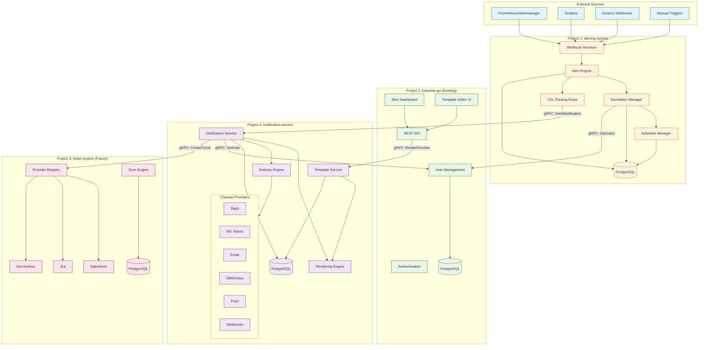
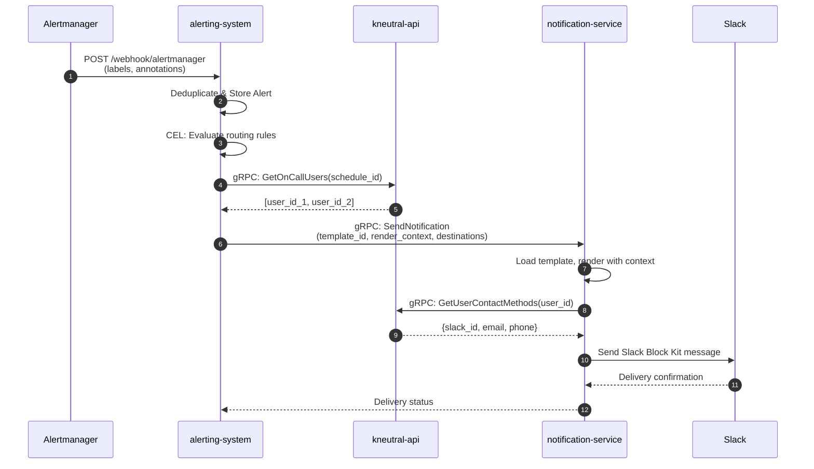
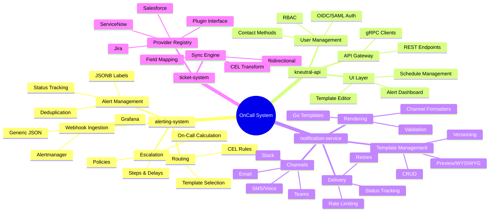
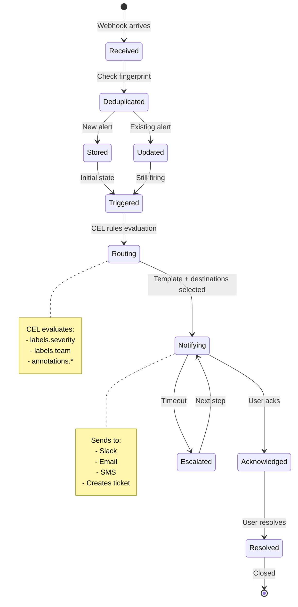
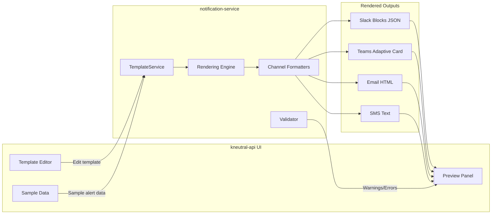
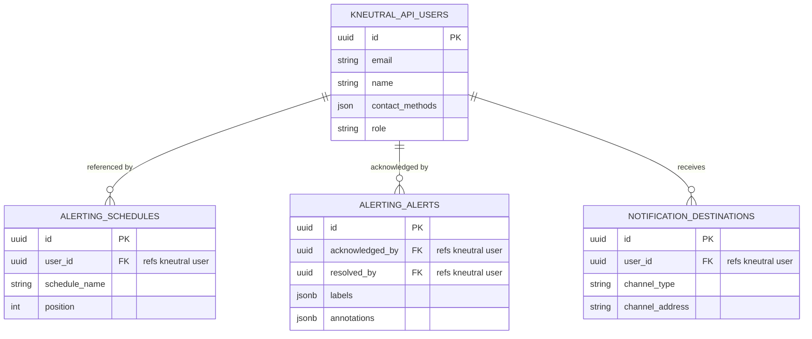
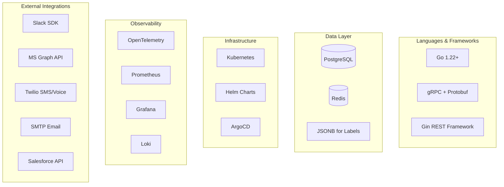
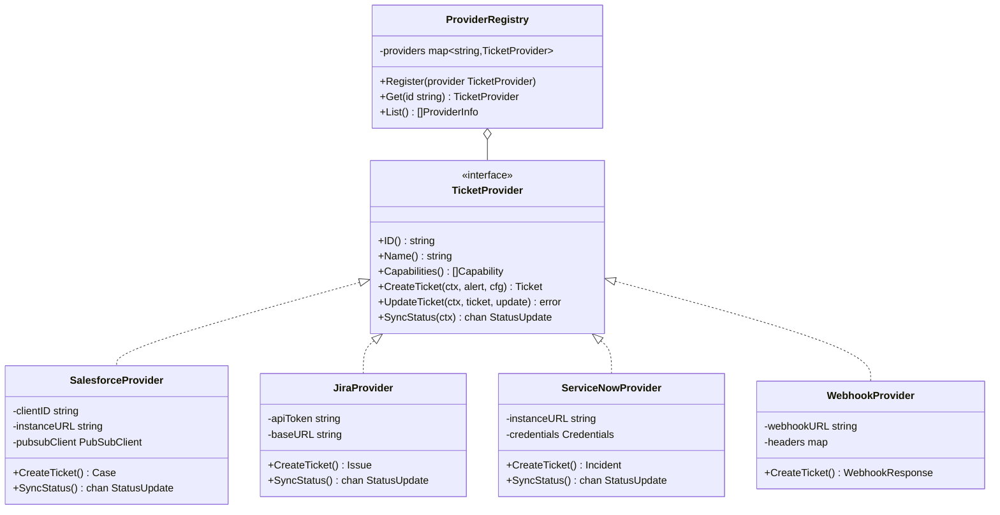
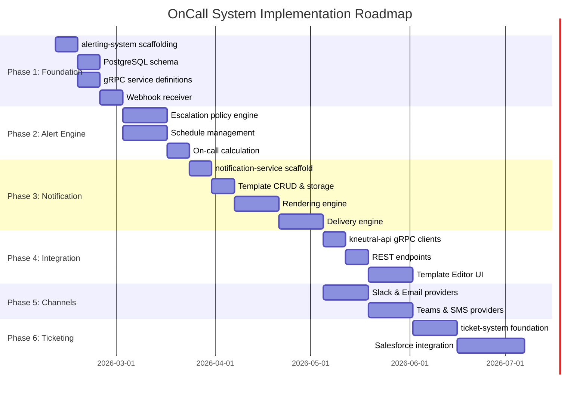

# OnCall System - Big Picture Architecture

> A modern, gRPC-native alerting and ticketing platform replacing GoAlert with simplified architecture, template management, and extensible integrations.

## System Overview



---

## Service Communication



---

## Project Responsibilities



---

## Data Flow: Alert Lifecycle



---

## Template System Flow



---

## User Reference Pattern



> **Key Principle:** alerting-system and notification-service **never store user data**. They only store `user_id` references and call kneutral-api via gRPC for user details.

---

## Technology Stack



---

## Ticket System Plugin Architecture



---

## Implementation Phases



---

## Key Design Decisions

| Decision | Choice | Rationale |
|----------|--------|-----------|
| **Services Count** | 4 services | Template Manager inside Notification Service for WYSIWYG guarantee |
| **Inter-service Comm** | gRPC | Efficient binary protocol, strong typing, streaming |
| **User Storage** | kneutral-api only | Single source of truth, avoids sync complexity |
| **Labels/Annotations** | JSONB in PostgreSQL | Flexible schema, queryable, no migrations for new labels |
| **Routing Rules** | CEL (Common Expression Language) | Auditable, no code deployment for rule changes |
| **Template Rendering** | Server-side | Security (prevent injection), consistency (WYSIWYG) |
| **Ticketing** | Plugin registry pattern | Extensible without core changes |

---

## AI Consensus (Gemini 3 Pro Preview + GPT 5.2)

### Agreement Points
- Notification Service must be separate from alerting-system
- Routing rules ("which template") stay in alerting-system
- Server-side rendering mandatory
- Use `google.protobuf.Struct` for dynamic Prometheus labels
- Preview API must use same renderer as production

### Final Decision
**Option B: 4 Services** (GPT 5.2 recommendation)
- Template Manager as module inside Notification Service
- WYSIWYG guarantee (same code path for preview and send)
- Simpler operations, no cross-service render drift
- Pattern: PagerDuty, Opsgenie

---

## Repository Structure

```
kneutral-org/oncall-system/
├── docs/
│   ├── ARCHITECTURE.md          # This document
│   ├── API.md                   # API specifications
│   └── DEPLOYMENT.md            # Deployment guide
├── proto/
│   ├── alerting/v1/             # Alert service protos
│   ├── notification/v1/         # Notification service protos
│   └── ticketing/v1/            # Ticket service protos
├── alerting-system/             # Project 1
├── notification-service/        # Project 4
├── ticket-system/               # Project 3 (future)
└── README.md
```

---

## Next Steps

1. **Create GitHub repo:** `kneutral-org/oncall-system`
2. **Initialize monorepo structure**
3. **Define gRPC proto files**
4. **Begin Phase 1 implementation**

---

*Document generated with AI assistance from Gemini 3 Pro Preview and GPT 5.2 via PAL MCP consensus workflow.*
